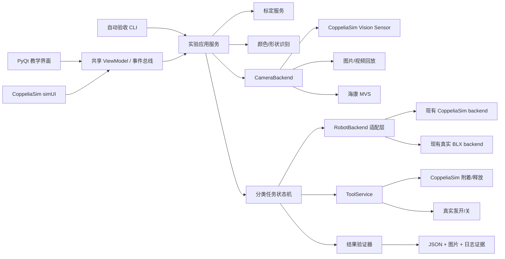

# CoppeliaSim 视觉机器人“仿真—真机同代码”一期总体设计

**日期：** 2026-07-30
**状态：** 已批准进入无人值守实施
**一期范围：** 实验三“机械臂与视觉系统标定” + 实验四“基于视觉的机械臂物体分类”
**最终人工门：** 教师只负责最终教学效果验收

## 1. 背景与目标

现有课程已经具备：

- BLX 六轴机械臂的 `sim / real` 双后端雏形；
- CoppeliaSim 中的关节控制、position-only 笛卡尔控制与 PyQt 教学入口；
- 实验三的三点仿射标定示例；
- 实验四至七的海康相机取图、OpenCV 识别和真机搬运代码；
- 厂家六轴机械臂 STEP 总装模型及其候选几何处理成果。

当前机器未连接海康相机，因此一期不能完成真实相机和真实机械臂的硬件验收。项目目标不是复刻工业级数字孪生，而是建立教学级预验证平台：

1. 学生先在 CoppeliaSim 中完成视觉标定、识别、抓取、搬运与分类；
2. 同一套实验任务代码只切换相机和机器人后端，即可在实验室连接真实设备；
3. 没有相机时仍可使用 CoppeliaSim 虚拟相机或真实图片回放完成学习；
4. 仿真结果提供机器可核验的证据，最终教学体验由教师人工验收。

## 2. 已确认的设计决策

### 2.1 开发路线

采用“分层增量开发”：

- 视觉、标定和实验任务逻辑只实现一套；
- 相机通过 `sim / replay / hik` 三种后端切换；
- 机器人通过现有 `sim / real` 后端切换；
- 外部 PyQt 和 CoppeliaSim simUI 共用同一任务状态与服务层；
- 一期先闭环实验三与实验四，再迁移实验五至七。

### 2.2 一期闭环验收链路

一期必须完成：

```text
CoppeliaSim 虚拟相机取图
→ 颜色/形状识别
→ 像素坐标转 BLX 世界坐标
→ 机械臂门字形路径移动
→ 模拟吸盘附着
→ 搬运到分类区
→ 释放
→ 自动核验分类结果
```

只完成“机械臂能动”不构成一期完成。

### 2.3 双界面、单逻辑

- **PyQt 主界面：** 正式学生实验入口，仿真和真机保持一致；
- **CoppeliaSim simUI：** 仿真现场简化面板，用于相机预览、标定、启动/暂停/复位和状态观察；
- **共享 ViewModel/事件流：** 两个界面不复制识别或任务代码。

本机已核对存在 `E:\CoppeliaSim\simUI.dll`、simUI 本地手册和 Python ZMQ 示例，具备实现条件。

### 2.4 机器人模型来源

唯一指定几何源：

```text
H:\智能机械与机器人基础\实训课\六轴机器臂模型\
LC-YT1119-BL23-A000(机械臂总组装）-ZQSZXYx-V1.1.2-SJ.zip
```

ZIP 内唯一 STEP 文件的 SHA-256：

```text
f3f493626792ef25b99e6b1e79f791da96f2526cee7161c90194443e9c34a9a2
```

仓库不再携带供应商 STEP 副本；其来源哈希、实体清单和分段记录由
`simulation/vision_lab/source_manifest.json` 与 `provenance/` 固定保存。

设计约束：

- 原始 ZIP/STEP 只读；
- 以厂家 STEP、141 volumes 清单、最新 segment mapping 和 OCP 实体级重导为几何主线；
- 旧 5 份 STL 与旧 `candidate_integration_contract_2026-06-07.json` 只作为历史证据；
- 保留已验证的 BLX 关节链、世界坐标语义和 TCP 作为运动学骨架；
- 在独立场景中替换/挂载厂家 STEP 派生外观；
- 不覆盖 `robot_backends/models/BLX_openr6.ttt`、正式 URDF 或正式 meshes。

## 3. 范围

### 3.1 一期包含

- 可复现 Python 运行环境；
- 统一配置与能力检测；
- 相机接口及 `sim / replay / hik` 三后端；
- 实验三三点仿射标定、保存、加载与误差验证；
- 实验四色和基本形状识别；
- 统一机械臂适配与安全门字形路径；
- CoppeliaSim 虚拟吸盘附着/释放；
- 指定 STEP 几何派生的独立视觉实训场景；
- PyQt 主界面；
- CoppeliaSim simUI 简化面板；
- 实验三和实验四自动化测试、仿真验收脚本和教学说明；
- 真机接入说明与硬件待验清单。

### 3.2 一期不包含

- 实验五“码垛”、实验六“OCR 数字排序”、实验七“YOLO 水果分类”的正式迁移；
- RX/RY/RZ 姿态 IK；
- 海康相机的硬件通过结论；
- 真实机械臂抓取精度或安全认证；
- 工业级碰撞规划、柔性吸盘、气路或高保真接触动力学；
- 覆盖或替换现有正式 BLX 场景。

## 4. 总体架构



核心原则：

- UI 不直接调用相机 SDK或机械臂 SDK；
- 识别器不感知图像来自仿真、回放还是真实相机；
- 任务状态机不感知对象是通过仿真附着还是真实吸盘抓取；
- 所有硬件导入采用延迟加载，缺少海康 SDK时仿真入口仍可启动；
- 自动验收使用与教学界面相同的应用服务，而不是另写一套演示逻辑。

## 5. 代码与资产布局

计划新增：

```text
vision_platform/
├── __init__.py
├── models.py
├── config.py
├── capabilities.py
├── events.py
├── cameras/
│   ├── base.py
│   ├── factory.py
│   ├── replay.py
│   ├── coppeliasim.py
│   └── hikvision.py
├── calibration/
│   ├── affine.py
│   └── store.py
├── recognition/
│   └── color_shape.py
├── robot/
│   ├── adapter.py
│   └── suction.py
├── tasks/
│   ├── state_machine.py
│   └── classify.py
├── ui/
│   ├── view_model.py
│   ├── pyqt_app.py
│   └── simui_panel.py
└── cli.py

simulation/vision_lab/
├── build_scene.py
├── verify_scene.py
├── scene_manifest.json
├── BL23_vision_lab.ttt
├── assets/
│   └── robot/
└── README.md

config/
└── vision_lab.default.json

tools/vision_lab/
├── bootstrap.ps1
├── run_pyqt.ps1
├── run_acceptance.ps1
└── launch_coppeliasim.ps1

tests/
├── test_vision_platform/
├── test_simulation/
└── test_acceptance/
```

现有实验目录继续保留，作为教学内容和算法来源；一期不在旧主程序内继续堆叠条件分支。

## 6. 统一数据契约

### 6.1 Frame

所有相机返回统一 `Frame`：

- `image_bgr: numpy.ndarray`
- `width: int`
- `height: int`
- `timestamp_s: float`
- `source: sim | replay | hik`
- `sequence_id: int`
- `intrinsics: optional`
- `depth_m: optional numpy.ndarray`
- `metadata: dict`

图像统一为 OpenCV BGR、左上角像素原点。后端负责把 CoppeliaSim 原始 RGB、方向和字节布局转换成该格式。

### 6.2 Detection

识别结果统一为：

- `detection_id`
- `center_px`
- `color`
- `shape`
- `angle_deg`
- `area_px`
- `contour`
- `confidence`
- `annotated_roi`

一期识别器允许返回多个对象。任务层必须明确选择规则，不能沿用旧代码“最后一个大轮廓覆盖前一个”的隐含行为。

### 6.3 Calibration

标定记录包括：

- 三个或更多 `pixel_points`；
- 对应的 BLX 世界坐标 `world_points_mm`；
- 2×3 仿射矩阵；
- 标定图像尺寸与来源；
- 抓取平面 Z；
- RMS 与最大验证误差；
- 创建时间、模型/场景版本。

实验教学保留三点仿射主线；实现允许使用额外验证点，但不把深度相机作为一期必需条件。

### 6.4 TaskResult

每次分类任务输出：

- 对象识别结果；
- 像素坐标与世界坐标；
- 规划路径；
- 吸附/释放事件；
- 目标分类区；
- 最终对象位置；
- 自动验证结论；
- 失败阶段与错误码；
- 关键帧和时间统计。

## 7. 相机后端

### 7.1 CoppeliaSimCamera

- 通过 ZMQ Remote API 获取指定 Vision Sensor 图像；
- 默认只使用 RGB；
- 可选读取米制深度供调试，不把深度作为三点标定替代品；
- 检查分辨率、帧号和超时；
- 处理上下翻转、RGB→BGR 和连续内存布局；
- 场景对象路径来自配置，不写死 handle。

### 7.2 ReplayCamera

- 从 manifest 顺序读取真实图片或视频；
- 默认复用实验三、实验四已有真实图片；
- 支持循环、单步和确定性帧序列；
- 用于无相机开发、算法回归和课堂演示；
- 实验七当前缺少可信水果图片，不纳入一期。

### 7.3 HikvisionCamera

- 只有选择 `VISION_BACKEND=hik` 时才导入 MVS；
- 封装枚举、打开、取帧、关闭和错误码；
- Windows/Linux SDK路径通过配置，不沿用硬编码 `/opt/MVS/...`；
- 当前机器只能完成静态接口、错误提示与可选 mock 测试；
- 真实帧率、曝光、触发模式和断线重连保留为实验室硬件验收项。

## 8. 标定与识别

### 8.1 仿射标定

采用：

```text
[X, Y]^T = A · [u, v, 1]^T
```

要求：

- 拒绝共线或近共线标定点；
- 拒绝图像尺寸与标定记录不匹配；
- 支持保存/加载 JSON；
- 提供正向像素→世界变换；
- 使用独立验证点计算 RMS 和最大误差；
- 仿真场景目标：RMS ≤ 3 mm，最大误差 ≤ 5 mm。

### 8.2 颜色/形状识别

一期从现有算法提取并修正：

- HSV 前景分割；
- 形态学去噪；
- 外轮廓过滤；
- 质心和最小外接矩形；
- 红、绿、蓝、黄颜色分类；
- 三角形、正方形、矩形、圆形分类；
- 多对象列表和稳定排序；
- 基于图像尺寸计算面积阈值，避免旧代码固定 `32000 px`；
- 空图、无轮廓、小 ROI 和边界 ROI 返回显式结果，不吞异常。

受控仿真场景的分类自动验收要求为 100%；真实回放集单独报告准确率，不借受控仿真结果代替真实图像结论。

## 9. 机器人与任务状态机

### 9.1 机器人适配

共享任务层只调用：

- `home()`
- `move_world(x_mm, y_mm, z_mm, speed)`
- `tool_on()`
- `tool_off()`
- `pose()`
- `close()`

适配器内部调用现有 `RobotBackend`，保留 7 参数 `move_coordinate_all` 兼容接口，并明确 RX/RY/RZ 传 0 且不参与控制。

### 9.2 门字形安全路径

默认流程：

1. 移动到抓取点上方安全高度；
2. 垂直下降到抓取高度；
3. 开启吸盘并确认附着；
4. 垂直抬升；
5. 水平移动到分类区上方；
6. 垂直下降；
7. 关闭吸盘；
8. 垂直抬升；
9. 验证对象最终分类；
10. 进入下一对象或回 home。

路径点在执行前经过：

- 工作空间边界检查；
- 安全 Z 检查；
- 目标对象仍存在检查；
- 标定有效性检查；
- 任务取消检查。

### 9.3 状态机

状态：

```text
IDLE
→ ACQUIRE
→ DETECT
→ CALIBRATE/TRANSFORM
→ APPROACH
→ DESCEND
→ ATTACH
→ LIFT
→ TRANSFER
→ RELEASE
→ VERIFY
→ COMPLETE
```

任何错误进入 `SAFE_STOP`：

- 立即禁止新动作；
- 尝试关闭吸盘；
- 只在路径可确认安全时抬升或回 home；
- 记录错误，不使用旧代码的线程强制终止；
- UI 显示可恢复操作。

## 10. CoppeliaSim 场景设计

### 10.1 场景隔离

新场景：

```text
simulation/vision_lab/BL23_vision_lab.ttt
```

构建来源：

1. 已验证 BLX 运动学骨架；
2. 厂家 STEP 派生、通过 provenance 校验的分段视觉 mesh；
3. 独立的教学工作台、虚拟相机、标定点、分类物体和分类区；
4. 独立吸盘附着逻辑。

正式 `robot_backends/models/BLX_openr6.ttt` 永不覆盖。

### 10.2 场景对象命名

稳定路径示例：

```text
/BLX_base_link
/BLX_joint1 ... /BLX_joint6
/BLX_tool_suction
/VisionLab
/VisionLab/Camera
/VisionLab/Workspace
/VisionLab/CalibrationPoints
/VisionLab/Pickables
/VisionLab/Zones
/VisionLab/Status
```

代码通过路径与 manifest 解析，不依赖每次加载可能变化的 handle。

### 10.3 几何与碰撞

- STEP 派生 mesh用于视觉展示；
- 碰撞体优先使用简化 primitive/convex 形状，避免高面数 CAD 直接参与动力学；
- 每段 mesh记录源 STEP 哈希、volume 映射、导出工具与输出哈希；
- 六个关节轴、方向、零位、限位、父子层级和 TCP 由独立验证脚本检查；
- 场景构建采用 ASCII staging 保存，再复制到中文项目路径，规避已知 `sim.saveScene` 中文路径问题。

### 10.4 虚拟相机

- 固定俯视工作平面；
- 分辨率、视场角、近远裁剪面写入配置和 manifest；
- 默认同步取图，保证“动作—取图—识别”的确定性；
- 工作区内布置至少 3 个标定点和额外验证点；
- 对象颜色与背景保持足够 HSV 分离，但保留轻度旋转和位置随机化。

### 10.5 模拟吸盘

吸附条件：

- 吸盘开启；
- 最近可抓对象位于 XY 和 Z 容差内；
- 对象未被其他工具占用；
- 对象属于 `/VisionLab/Pickables`。

吸附成功后：

- 保存对象原 parent 和动力学属性；
- 以保持世界位姿方式 parent 到 TCP/吸盘节点；
- 发送 `attached` 事件。

释放时：

- 恢复到工作区父节点；
- 恢复动力学属性；
- 保持释放瞬间世界位姿；
- 发送 `released` 事件；
- 等待短暂稳定后验证所在分类区。

## 11. 界面设计

### 11.1 PyQt 主界面

至少包含：

- 机器人后端：`sim / real`；
- 相机后端：`sim / replay / hik`；
- 能力与连接状态；
- 原始/标注图像；
- 标定点表、矩阵和误差；
- 识别结果表；
- 像素坐标与世界坐标；
- 当前任务状态；
- 启动、暂停、继续、复位、急停；
- 单步教学模式与全自动模式；
- 运行日志和验收结果。

耗时操作进入受控 worker，通过 Qt signal 更新 UI；禁止 `PyThreadState_SetAsyncExc` 强杀线程。

### 11.2 CoppeliaSim simUI

提供精简面板：

- 当前模式与连接状态；
- 相机缩略图；
- 标定/识别摘要；
- 当前对象、像素和世界坐标；
- 启动、暂停、复位；
- 当前状态与最终 PASS/FAIL。

simUI 只发送命令和展示共享状态，不包含第二份业务逻辑。

## 12. 配置与运行环境

### 12.1 配置优先级

```text
命令行参数 > 环境变量 > config/vision_lab.default.json
```

关键变量：

- `ROBOT_BACKEND=sim|real`
- `VISION_BACKEND=sim|replay|hik`
- `COPPELIASIM_ROOT`
- `COPPELIA_HOST`
- `COPPELIA_PORT`
- `COPPELIA_SCENE`
- `VISION_LAB_CONFIG`
- `HIK_MVS_ROOT`

### 12.2 Python 环境

新增独立 `.venv-vision`，目标 Python 3.11，不修改系统全局环境。

一期依赖：

- numpy
- opencv-python
- PyQt5
- pyzmq
- cbor2
- pytest
- pytest-qt

场景资产构建的开发依赖单独维护：

- trimesh
- cadquery-ocp（提供 `OCP` 命名空间）

CoppeliaSim ZMQ Python client从本机安装目录发现并加入环境；启动脚本必须在缺失时给出明确修复提示。

## 13. 错误处理和安全边界

错误必须带稳定错误码和用户可读中文消息：

- `CAMERA_UNAVAILABLE`
- `FRAME_TIMEOUT`
- `CALIBRATION_MISSING`
- `CALIBRATION_INVALID`
- `DETECTION_EMPTY`
- `DETECTION_AMBIGUOUS`
- `TARGET_OUT_OF_WORKSPACE`
- `IK_FAILED`
- `SUCTION_ATTACH_FAILED`
- `DROP_VERIFY_FAILED`
- `TASK_CANCELLED`

禁止：

- 无提示吞异常；
- 相机缺失导致整个应用 import 崩溃；
- 在 worker 线程直接操作 Qt 控件；
- 强制终止 Python 线程；
- 未确认可达性就下降；
- 把受控仿真 PASS写成真机硬件 PASS；
- 把 position-only 描述成完整六维位姿控制。

## 14. 测试与验收

### 14.1 测试层级

1. **纯单元测试**
   - 数据契约、配置、仿射标定、识别、状态机、安全检查。
2. **适配器契约测试**
   - 三种相机后端返回同一 Frame；
   - sim/real 机器人适配器调用语义一致；
   - Hikvision 不可用时优雅降级。
3. **CoppeliaSim 集成测试**
   - 场景加载、对象路径、相机取图、IK、附着、释放、分类区核验。
4. **端到端自动验收**
   - 实验三标定；
   - 实验四至少一轮多对象完整分类；
   - 输出 JSON、关键帧和日志。
5. **人工教学验收**
   - 教师按学生视角完成一次标定和一次分类实验。

### 14.2 一期机器验收标准

必须同时满足：

- 新增测试全部通过；
- 修正既有 IRB140 遗留断言后，完整 pytest 无失败；
- 指定 STEP provenance 哈希匹配；
- 独立场景包含六轴机器人、相机、工作区、标定点、可抓物和分类区；
- 仿射标定 RMS ≤ 3 mm、最大误差 ≤ 5 mm；
- 受控仿真颜色/形状识别准确率 100%；
- 至少 6 个受控对象完成完整抓取—分类—释放；
- 6 次吸附和释放事件均成功；
- 最终每个对象位于正确分类区；
- PyQt 启动检查无立即崩溃；
- simUI 可以创建、更新和销毁；
- 正式 BLX 场景、URDF、meshes 哈希不变；
- 自动报告明确把真实海康相机和真机验收标记为 `PENDING_HARDWARE`。

### 14.3 最终人工教学验收

教师只需检查：

1. 学生能否按说明启动 CoppeliaSim 和 PyQt；
2. 是否理解三点标定及像素—世界坐标关系；
3. 是否能观察识别、抓取和分类全过程；
4. 仿真/回放/真机模式切换是否容易理解；
5. 学生修改高层任务代码后，是否能明确知道真机验证路径；
6. 界面、提示和实验节奏是否适合课堂。

真实相机与真实机械臂仍需在实验室完成独立硬件验收，不能由本机自动验收替代。

## 15. 实施阶段

### 阶段 0：基线与环境

- 建立隔离分支和工作树；
- 记录现有测试失败；
- 建立 Python 3.11 独立环境；
- 修正与 BLX 主线冲突的陈旧测试。

### 阶段 1：共享核心与回放

- 数据契约、配置和能力检测；
- ReplayCamera；
- 仿射标定；
- 颜色/形状识别；
- 任务状态机；
- 使用 fake/replay 完成闭环测试。

### 阶段 2：CoppeliaSim 场景与后端

- 整理厂家 STEP 派生几何 provenance；
- 建立独立场景；
- 实现虚拟相机；
- 实现模拟吸盘；
- 完成场景验证和无 UI 端到端验收。

### 阶段 3：双界面

- PyQt 主界面；
- simUI 简化面板；
- 共享 ViewModel；
- 暂停、继续、复位和急停。

### 阶段 4：课程闭环与交付

- 实验三/四教学步骤；
- 自动验收脚本；
- 关键帧、JSON 和日志证据；
- 真机迁移清单；
- 最终教师教学效果验收。

## 16. 风险与应对

### 16.1 厂家 STEP 派生几何尚有历史路线混杂

应对：

- 只认最新 HERMES 中的 STEP + 141 volumes + segment mapping + OCP 主线；
- 新场景必须带 provenance manifest；
- 对每段视觉 mesh做 hash、边界盒、连杆跟随和外观截图验收；
- 旧 5 STL 场景不得直接成为一期正式资产。

### 16.2 BLX position-only 与工作空间有限

应对：

- 物体布局通过可达性预扫描生成；
- 吸盘保持固定朝向，不引入姿态 IK；
- 所有下降动作先通过工作空间检查；
- 超出范围给出明确教学提示。

### 16.3 `.ttt` 为二进制且中文路径保存不稳定

应对：

- 场景构建脚本可重复执行；
- 先保存到 ASCII staging，再复制到目标；
- manifest记录构建输入和输出哈希；
- 自动验收不只依赖二进制场景存在。

### 16.4 当前无海康相机

应对：

- sim和 replay 是一期自动验收主路径；
- hik 后端只做接口、延迟加载与错误处理；
- 真实硬件结论明确待验。

### 16.5 双界面状态漂移

应对：

- 单一应用服务和 ViewModel；
- 两个 UI 只订阅事件和发送命令；
- 状态机拥有唯一写权限；
- 用契约测试证明同一事件序列得到同一界面状态。

## 17. 完成定义

一期只有在以下条件全部成立时才可进入最终人工验收：

1. 本设计对应的详细实施计划已执行完；
2. 实验三、四共享核心与三个相机后端接口已落地；
3. 指定 STEP 派生的独立 CoppeliaSim 视觉场景已生成并验证；
4. 仿真相机、吸盘和分类结果验证形成闭环；
5. PyQt 和 simUI 共用同一逻辑；
6. 自动化测试和端到端验收达到第 14 节标准；
7. 正式 BLX 资产未被覆盖；
8. 教学说明、自动证据和硬件待验清单齐备；
9. 最终只剩教师的教学效果人工验收。
