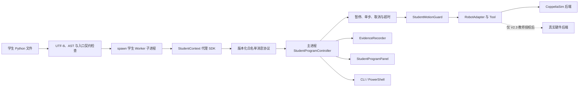

# 视觉仿真实训平台 V2.1 学生程序载入与受控执行设计

**文档状态：** 已确认开发方向，已按干净发布仓库更新

**初版日期：** 2026-07-30

**本次更新：** 2026-07-31

**当前项目根目录：** `C:\Users\yqzhe\Documents\Robot Sim\Blinx-CoppeliaSim-clean`

**开发基线：** `origin/main`，提交 `7546db7`

**一期正式场景：** `simulation/vision_lab/BL23_vision_lab.ttt`

## 1. 更新说明

本版替代此前以旧 H 盘工作树和旧功能分支为基线的版本。功能方向不变，开发和交付约束更新如下：

- 以干净发布仓库为唯一开发源，不再从 H 盘旧工作树创建分支；
- 开发分支从 `origin/main` 创建，建议命名为 `codex/student-program-runner-v2`；
- Python 环境由仓库内 `tools/vision_lab/bootstrap.ps1` 创建，不引用外部固定虚拟环境；
- 当前静态测试基线为 `158 passed, 2 skipped`，两个 skip 是显式启用的 CoppeliaSim 在线测试，不能当作在线验收通过；
- 正式机器人资产清单以 `simulation/vision_lab/robot_assets_manifest.json` 为准；
- 发布完整性测试继续放在 `tests/test_acceptance/test_delivery_contract.py`；
- V2.1 不创建或依赖仓库中不存在的额外项目简报；
- 所有新增交付文件必须同步登记到 `RETAINED_FILES.txt`。

## 2. 背景与问题

一期已经提供可运行的视觉仿真实验基线：

- OpenR6 六轴机械臂与自定义吸盘；
- CoppeliaSim 顶视相机、标定板、抓取物和分类区；
- 三点仿射标定与独立验证点；
- 颜色和形状识别、六物体分类闭环；
- PyQt 教学控制台与 CoppeliaSim simUI 状态面板；
- replay、CoppeliaSim 和可选海康相机适配层；
- 仿真自动验收、场景验证和真机迁移清单。

现有运动能力包括：

- `RobotAdapter.move_home()`；
- `RobotAdapter.move_world(x_mm, y_mm, z_mm, speed=...)`；
- `RobotAdapter.current_world_pose()`；
- `WorkspacePolicy.validate()` 与 `plan_gate_path()`；
- `CoppeliaSimSuction.on()`、`off()` 和附着状态；
- `VisionLabApplication` 对相机、机械臂、工具、标定和任务的统一装配。

当前缺口是学生自编程闭环。学生还不能在教学界面中打开自己的 Python 文件，对其进行契约检查，并以可暂停、可单步、可停止、可复位和可追溯的方式驱动 CoppeliaSim 机械臂。

## 3. V2 路线与本轮范围

V2 分为三个独立验收阶段：

1. **V2.1 学生程序载入与受控执行：** 学生 SDK、独立执行进程、安全命令网关、PyQt 编程页、CLI 和运行证据。
2. **V2.2 自动评分与视觉算法开放：** 原始图像接口、自定义识别函数、任务评分和教师批量验收。
3. **V2.3 真机迁移：** 海康相机和真实机械臂接入后的授权、标定、急停、低速空跑和分级放行。

本设计只实施 V2.1。V2.2 和 V2.3 仅保留兼容边界，不进入本轮开发。

## 4. 用户目标

### 4.1 学生

学生能够：

1. 从仓库模板创建 Python 控制程序；
2. 在 PyQt 中打开、编辑、保存、另存、检查和运行程序；
3. 使用统一 SDK 完成回零、世界坐标移动、TCP 查询、吸盘开启和关闭；
4. 在每条受控命令边界暂停或单步；
5. 获得语法、契约、越界、低空横移、超时和运行异常的明确中文提示；
6. 停止或失败后让系统执行安全收尾并可复位场景；
7. 获得包含源码快照、命令、事件、错误和结果的独立证据目录。

### 4.2 教师

教师能够：

1. 观察当前状态、命令、序号、运行时间和 TCP；
2. 随时暂停、单步、停止和复位；
3. 确认学生代码不能自行切换真实机械臂；
4. 根据证据目录复核学生提交；
5. 在 V2.3 中继续复用同一高层学生接口。

## 5. 非目标与安全边界

V2.1 不实现：

- 对恶意 Python 代码的操作系统级安全沙箱；
- 自动生成正式课程成绩；
- 学生直接调用 `RemoteAPIClient`、`sim`、`simIK` 或 CoppeliaSim 对象路径；
- 学生直接获得 `VisionLabApplication`、`robot_backends` 或工具实例；
- 真实海康相机、真实机械臂、急停、气路和物理抓取验收；
- RX、RY、RZ 姿态控制；
- 直接关节角控制；
- 学生自定义 OpenCV 识别算法；
- 多学生并发控制同一仿真场景；
- 修改正式 `.ttt`、URDF、STL 或机器人来源证明。

`multiprocessing` 子进程只用于故障隔离、生命周期控制和通信收口，不是恶意代码安全边界。若运行来源不可信的代码，实验室仍需使用独立 Windows 账号、虚拟机或可还原教学终端。

## 6. 总体架构



架构原则：

- CoppeliaSim 连接、`VisionLabApplication`、机器人和吸盘只存在于主进程；
- 学生子进程只持有代理 SDK，不导入项目内部机器人实现；
- 每个 SDK 调用转换成一条白名单命令，主进程校验后才能执行；
- 不使用任意 `getattr` 分派；
- 暂停和单步只发生在命令边界，不强行中断已经进入底层 IK 的单条命令；
- PyQt 与 CLI 复用同一个控制器，不复制安全逻辑；
- 场景复位通过重新创建 `VisionLabApplication` 会话完成，避免复用已关闭实例。

## 7. 模块边界

新增包 `vision_platform/student/`：

| 文件 | 单一职责 |
| --- | --- |
| `protocol.py` | 协议版本、命令名、状态、错误码和可序列化消息模型 |
| `validator.py` | 文件大小、UTF-8、AST、入口签名和禁用导入检查 |
| `sdk.py` | 学生可见的 `StudentContext`、`StudentRobot`、`StudentTool` 代理 |
| `worker.py` | `spawn` 子进程入口、动态载入、`main(ctx)` 调用和异常封装 |
| `safety.py` | 参数、速度、命令数、运行时限、路径和吸盘高度检查 |
| `evidence.py` | 运行目录、源码哈希、JSONL 和总结文件 |
| `runner.py` | 状态机、进程、协议、安全执行、清理和事件投影 |

应用会话管理器放在 `vision_platform/session.py`，负责创建、关闭和替换 `VisionLabApplication`。

UI 新增 `vision_platform/ui/student_program_panel.py`。该面板只负责编辑器、按钮和状态展示，通过控制器公开方法操作，不直接接触机器人。它作为现有 `VisionLabWindow.tabs` 的“学生编程”页签加入，因此学生可同时观察左侧相机画面。原标定、识别、分类、simUI 和验收流程不得改变。

## 8. 学生程序契约

每个程序必须定义且只能定义一个顶层同步入口：

```python
def main(ctx):
    pick = (55, -55, 20)
    drop = (122, -66, 20)
    safe_z = 110

    ctx.log("程序开始")
    ctx.robot.home()
    ctx.robot.move_world(pick[0], pick[1], safe_z, speed=15)
    pick_approach_pose = ctx.robot.pose()
    ctx.robot.move_world(
        pick_approach_pose[0], pick_approach_pose[1], pick[2], speed=8
    )
    ctx.tool.on()
    pick_pose = ctx.robot.pose()
    ctx.robot.move_world(pick_pose[0], pick_pose[1], safe_z, speed=12)
    ctx.robot.move_world(drop[0], drop[1], safe_z, speed=15)
    drop_approach_pose = ctx.robot.pose()
    ctx.robot.move_world(
        drop_approach_pose[0], drop_approach_pose[1], drop[2], speed=8
    )
    ctx.tool.off()
    drop_pose = ctx.robot.pose()
    ctx.robot.move_world(drop_pose[0], drop_pose[1], safe_z, speed=12)
    ctx.robot.home()
    ctx.log("程序结束")
```

V2.1 SDK 固定为：

```python
class StudentContext:
    robot: StudentRobot
    tool: StudentTool

    def log(self, message: str) -> None: ...
    def sleep(self, seconds: float) -> None: ...
    def checkpoint(self, label: str) -> None: ...


class StudentRobot:
    def home(self) -> None: ...
    def move_world(
        self,
        x_mm: float,
        y_mm: float,
        z_mm: float,
        *,
        speed: float,
    ) -> None: ...
    def pose(self) -> tuple[float, float, float]: ...


class StudentTool:
    def on(self) -> None: ...
    def off(self) -> None: ...
```

约束：

- 坐标单位统一为毫米；
- `move_world` 延续一期 position-only 合同，不开放姿态参数；
- `ctx.sleep()` 最大单次 5 秒且必须可响应取消；
- `ctx.log()` 单条最大 500 字符；
- `ctx.checkpoint()` 只记录教学检查点，不绕过命令门控；
- `main` 只允许一个必选位置参数，不允许异步入口；
- 返回 `None` 表示正常结束，抛出异常表示失败。

## 9. 静态校验

运行前必须同时通过：

1. 扩展名为 `.py`；
2. 文件不超过 256 KiB；
3. 严格按 UTF-8 解码；
4. `ast.parse()` 成功；
5. 顶层有且只有一个 `main`；
6. `main` 是同步函数且只有一个必选位置参数；
7. 禁止顶层直接调用动作；
8. 禁止导入以下模块及其子模块：
   - `robot_backends`
   - `vision_platform.application`
   - `coppeliasim_zmqremoteapi_client`
   - `subprocess`
   - `socket`
   - `ctypes`

每个问题包含稳定错误码、中文消息、行号和列号。导入限制用于减少误操作，不宣称能阻止恶意绕过。

## 10. 命令协议

父子进程使用 `multiprocessing.get_context("spawn")` 和双向 `Connection`。命令必须是可序列化字典：

```json
{
  "schema_version": 1,
  "kind": "command",
  "command_id": "000012",
  "name": "robot.move_world",
  "args": {
    "x_mm": 100.0,
    "y_mm": 60.0,
    "z_mm": 120.0,
    "speed": 15.0
  }
}
```

响应：

```json
{
  "schema_version": 1,
  "kind": "result",
  "command_id": "000012",
  "status": "PASS",
  "value": null,
  "error": null
}
```

V2.1 白名单命令：

- `context.log`
- `context.sleep`
- `context.checkpoint`
- `robot.home`
- `robot.move_world`
- `robot.pose`
- `tool.on`
- `tool.off`

未知命令返回 `COMMAND_NOT_ALLOWED`；协议版本不匹配返回 `PROTOCOL_VERSION_UNSUPPORTED`；`command_id` 不匹配返回 `PROTOCOL_CORRELATION_ERROR`。

## 11. 状态机与操作语义

```text
EMPTY
  → LOADED
  → VALIDATED
  → RUNNING
  ↔ PAUSED
  → PASSED | FAILED | CANCELLED
  → RESETTING
  → VALIDATED
```

规则：

- `VALIDATED` 之前不能运行；
- `RUNNING` 才能暂停；
- 暂停请求在当前命令完成后生效；
- `PAUSED` 的“下一步”只放行一条后续命令，完成后仍为 `PAUSED`；
- `PAUSED` 的“继续”回到 `RUNNING`；
- `RUNNING` 和 `PAUSED` 可以停止；
- `PASSED`、`FAILED`、`CANCELLED` 后必须复位，才能开始下一次正式运行；
- 窗口关闭时先取消、回收子进程、安全收尾，再关闭应用。

按钮启用状态只由状态映射表决定，不允许各个槽函数分别维护。

## 12. 安全策略

默认限制：

| 项目 | 限制 |
| --- | --- |
| 速度 | `1 <= speed <= 30` |
| 总命令数 | 最多 200 |
| 总运行时间 | 最多 60 秒 |
| 单条命令等待 | 最多 10 秒 |
| 单次 `sleep` | 最多 5 秒 |
| 单条日志 | 最多 500 字符 |
| 吸盘开启高度 | `z <= 35 mm` |

动作规则：

1. XYZ 必须通过现有 `WorkspacePolicy.validate()`；
2. 目标和当前 TCP 必须是有限数值；
3. 存在 XY 横移时，起点和终点 Z 均不得低于 `safe_z_mm`；
4. 低于安全高度时只允许 XY 不变的垂直升降；
5. `tool.on()` 仅在当前 TCP 的 Z 不高于 35 mm 时允许；
6. `tool.off()` 可在任意合法工作空间位置执行；
7. 真实机械臂后端在 V2.1 无条件返回 `REAL_BACKEND_NOT_AUTHORIZED`；
8. 所有拒绝必须发生在调用底层机器人或吸盘之前。

停止或失败后的顺序：

1. 停止接受新命令；
2. 请求子进程退出；
3. 超过宽限时间后终止并回收子进程；
4. 尝试 `tool.off()`；
5. 若当前 TCP 有效且低于安全高度，尝试垂直升至 `safe_z_mm`；
6. 尝试 `robot.move_home()`；
7. 记录所有收尾错误，但不覆盖原始错误。

## 13. PyQt 学生编程页

页面必须包含：

- 当前程序路径；
- 打开、保存、另存为；
- UTF-8 Python 编辑器；
- “检查程序”按钮；
- “运行、暂停、继续、下一步、停止、复位”按钮；
- 状态徽标；
- 当前命令、命令序号、运行时间和 TCP；
- 只读事件控制台；
- 本次证据目录。

界面规则：

- 打开文件前，如编辑器有未保存修改，必须提示保存、放弃或取消；
- 校验成功后如果文本发生变化，状态退回 `LOADED`；
- 运行时禁止编辑和切换程序；
- 不弹出模态对话框阻塞子进程清理；
- 关闭窗口时等待控制器完成有界清理；
- 原视觉实验页的控件对象名和已有自动化测试保持兼容。

## 14. CLI 与 PowerShell 入口

仓库内 Python 包装器用于避免写死虚拟环境路径：

```powershell
powershell -ExecutionPolicy Bypass -File tools\vision_lab\python.ps1 `
  -m vision_platform.cli student-validate `
  --program student_programs\pick_and_place.py

powershell -ExecutionPolicy Bypass -File tools\vision_lab\run_student_program.ps1 `
  -Program student_programs\pick_and_place.py
```

CLI 子命令：

- `student-validate --program <path>`：只做静态检查，输出 JSON；
- `student-run --program <path> --robot sim --scene <path> --output <dir>`：运行并返回 0/1；
- `student-run` 若收到 `--robot real`，必须返回 `REAL_BACKEND_NOT_AUTHORIZED`。

PowerShell 入口负责定位项目、启动或复用 CoppeliaSim、传递端口和场景并调用 CLI，不复制 Python 安全逻辑。

### 14.1 CoppeliaSim readiness 与进程所有权

- `vision_platform/coppeliasim_readiness.py` 是正式 readiness helper；它通过项目
  `.venv-vision` 使用 fresh ZMQ client 验证真实 RPC、目标场景路径以及
  `/VisionLab`、`/BLX_base_link`，不能只把 TCP 23000 打开当作可用。
  `timeout_s` 必须有限且不小于 0，retry interval 必须有限且大于 0；两者
  在首次 client factory 前验证。成功 client 必须先完成 socket
  `linger=0` 与 context 释放，之后才允许打印 `READY`；清理失败只能打印
  `NOT_READY`。
- `launch_coppeliasim.ps1` 在启动或取得既有 listener 后立即冻结规范化
  启动身份，并返回唯一结构化结果，包含 `StartedByScript`、`ProcessId`、
  `ProcessPath` 和 `ProcessStartTimeUtcTicks`。`run_acceptance.ps1`、
  `run_student_program.ps1` 与 `run_pyqt.ps1` 只在
  `StartedByScript=true` 时于 `finally` 传递启动时捕获的 PID、规范路径和
  UTC 启动 ticks；复用的用户 listener 永不终止。四个入口共用
  `tools/vision_lab/process_ownership.ps1`；路径不一致、`WaitForExit`
  超时或相同启动三元组仍存活都必须使入口失败，禁止忽略清理结果。
  launcher 在启动前以 `Resolve-Path` 规范化 `CoppeliaRoot` 与 executable，
  包括带 `\.` 的路径。停止时必须执行
  `Stop-Process -InputObject $VerifiedProcess`，不能在验证对象后再按 PID
  停止。helper 在首次 `Get-Process` 后、停止前严格比较启动时捕获的三元组；
  路径或启动时间无法读取、任一字段不匹配时均失败且不调用停止。停止后的
  survivor 仍与原三元组比较，PID 复用后的新对象不得被停止。如果
  `Start-Process` 已成功但首次身份捕获失败，launcher 必须改用
  `Stop-StartedProcessObject`，只把 `Start-Process` 返回的原始 Process
  对象交给 `Stop-Process -InputObject` 并等待退出；该回退不得查询或按
  未验证 PID 查杀。
- 在线 pytest fixture 不启动或终止 CoppeliaSim，只连接已由
  `launch_coppeliasim.ps1` 验证的 BL23 listener，管理
  stop→load→start 和 fresh-client teardown。临时场景载入后的启动或
  running-readiness 失败，也必须用 fresh clients 停止并恢复正式源场景，
  同时保留准备异常为主异常、清理异常为 cause。缺 listener 或场景错误
  必须 FAIL 并给出启动命令。
- pytest 端点参数为 `--coppelia-host` 和 `--coppelia-port`，优先级为
  显式参数、`COPPELIA_HOST`/`COPPELIA_PORT`、最后
  `127.0.0.1:23000`。`run_acceptance.ps1` 的两组在线 pytest 必须透传
  本次 `HostAddress`/`Port`，不能暗中回到 23000。
- 直接运行 `-m coppeliasim` 前，必须先运行
  `tools/vision_lab/launch_coppeliasim.ps1`；完整自动验收则由
  `run_acceptance.ps1` 持有并最终回收自己启动的进程。该脚本必须在写
  `acceptance-summary.json` 前完成清理；清理失败时汇总为 `FAIL` 且退出
  非零。

## 15. 证据与可追溯性

每次运行生成唯一目录：

```text
artifacts/vision_lab/student-runs/
└── 20260731-203015-pick_and_place-a1b2c3d4/
    ├── source.py
    ├── source.sha256
    ├── manifest.json
    ├── commands.jsonl
    ├── events.jsonl
    └── summary.json
```

`summary.json` 至少包含：

- `schema_version`
- `run_id`
- `status`
- `program_path`
- `source_sha256`
- `started_at`
- `finished_at`
- `elapsed_seconds`
- `command_count`
- `last_pose_mm`
- `safety_violation_count`
- `error`
- `cleanup_errors`
- `robot_backend`
- `hardware_status`

仿真运行的 `hardware_status` 固定为 `PENDING_HARDWARE`。证据写入失败必须使运行结果为 `FAILED`，不能只写日志后继续宣称通过。

## 16. 测试与验收

### 16.1 自动测试

1. 协议、校验器、SDK、安全网关、状态机和证据写入的纯单元测试；
2. Fake 后端的进程运行、暂停、继续、单步、停止、超时和清理集成测试；
3. PyQt 离屏测试：页面构造、文件操作、按钮状态和运行投影；
4. 发布合同测试：入口、模板、文档和 `RETAINED_FILES.txt`；
5. CoppeliaSim 在线测试：逐条核对 `commands.jsonl` 中完整关键顺序与六个
   `move_world` 的坐标/速度；两个下探动作的 X/Y 必须分别等于其前一条
   `robot.pose` 返回的实测安全高度 X/Y，仅 Z 改为抓取或放置高度。完成
   吸盘开关和回零后，还必须通过
   `application.sim` 证明
   `/VisionLab/Pickables/object_01_red_square` 的最终 XY 位于 red zone
   范围内。仿真结果仍为 `PENDING_HARDWARE`。

### 16.2 基线保护

- 修改前记录 `git status`、基线提交和现有测试结果；
- 静态回归不得少于当前基线的 158 个通过用例；
- 两个在线测试的 skip 只表示本次静态运行未启用 CoppeliaSim；
- 完整交付必须单独运行 `-m coppeliasim` 在线测试并获得 PASS；
- `simulation/vision_lab/robot_assets_manifest.json` 中受保护资产的实际哈希必须保持不变；
- 原 `tools/vision_lab/run_acceptance.ps1` 的闭环、simUI、PyQt 和场景验证继续通过。

### 16.3 V2.1 软件完成条件

以下条件全部满足才能标记 V2.1 软件完成：

1. 示例学生程序不导入项目内部实现；
2. PyQt 能完成打开、编辑、保存、校验、运行和复位；
3. 合法程序在 CoppeliaSim 中完成预定动作；
4. 越界和低空横移在底层调用前被拒绝；
5. 暂停后不放行下一条命令；
6. 单步只放行一条命令；
7. 停止后子进程退出、吸盘关闭且场景可复位；
8. 死循环程序在 60 秒总时限内终止并生成失败证据；
9. 每次运行生成独立且结构完整的证据目录；
10. 原有静态测试和实时验收不退化；
11. 场景、URDF、STL 和机器人资产哈希不变；
12. 新增交付文件全部进入 `RETAINED_FILES.txt`；
13. 真实硬件继续明确标记 `PENDING_HARDWARE`。

## 17. 发布文件边界

V2.1 实现新增的 Python、测试、模板、脚本和文档必须逐项加入 `RETAINED_FILES.txt`。发布合同测试应验证：

- 白名单中的每个路径真实存在；
- V2.1 必需入口和模板在白名单中；
- 白名单不包含运行生成的 `artifacts/`、`.venv-vision/`、缓存或学生个人提交；
- 本设计、实施方案和开发端 Prompt 均属于正式文档。

## 18. 后续兼容边界

V2.2 可在不破坏 V2.1 SDK 的前提下增加：

- `ctx.camera.capture()`；
- `ctx.vision.detect()`；
- 学生自定义 `detect(image)`；
- 基于最终场景状态、碰撞、路径长度和时间的评分；
- 教师批量运行和成绩导出；
- 初学者动作序列模式。

V2.3 只有在连接真实硬件并完成 `docs/仿真转真机验证清单.md` 后，才可增加：

- 教师授权开关；
- 真实后端低速上限；
- 急停联锁；
- 真实 TCP 和抓取高度；
- 海康相机重新标定；
- 单物体到多物体逐级放行。

仿真 PASS 不得替代真机验收。
