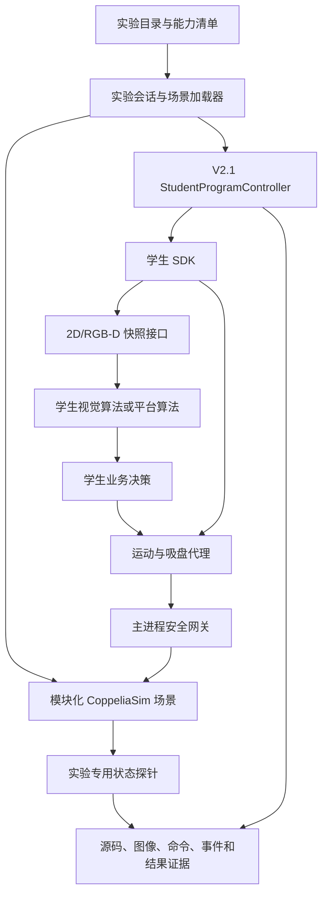

# 机器人/CoppeliaSim 课程实验扩展总体设计

**文档状态：** 总体方向已确认，书面规格待用户审阅

**初版日期：** 2026-07-31

**项目根目录：** `C:\Users\yqzhe\Documents\Robot Sim\Blinx-CoppeliaSim-clean`

**规划分支：** `codex/v2-2-curriculum-roadmap`

**当前开发前置：** V2.1“学生程序载入与受控执行”

**课程资料来源：** `H:\智能机械与机器人基础\实训课`

## 1. 决策摘要

平台的后续总目标不是覆盖课程目录中的全部 Python、机器学习和通用图像处理实验，而是迁移那些在机器人/CoppeliaSim 环境中仍能保留核心学习目标、形成“感知—决策—运动—验证”闭环的实验。

采用“能力平台 + 模块化实验包”的方式组织课程，不按旧文件夹一对一复制，也不建设包含全部设备和任务的单一巨型场景。规划形成 24 个候选正式实验：

- R1 机器人基础与视觉应用：7 项；
- V1 二维机器视觉：9 项；
- A1 AI 视觉：1 项；
- D1 RGB-D 空间感知：3 项；
- ROS2 机器人通信与运动规划：3 项；
- C1 综合工程：1 项。

V2.1 继续由当前开发端完成，不重新拆分。后续首批 V2.2 聚焦多实验框架、机器人基础、码垛、数字排序和水果/构件分类，不先建设自动评分。

## 2. 背景

当前平台已经提供：

- BL23/OpenR6 六轴机械臂、自定义吸盘和受保护机器人资产；
- 正式场景 `simulation/vision_lab/BL23_vision_lab.ttt`；
- CoppeliaSim 虚拟相机、三点标定、颜色/形状识别和六物体分类；
- replay、仿真和可选海康相机适配层；
- PyQt 教学界面、simUI、CLI、自动验收和真机迁移清单；
- 正在开发的 V2.1 学生 SDK、spawn 子进程、安全网关、运行控制和证据留档。

课程资料共包含 8 个板块、93 份实验指导 PDF。并非所有实验都适合迁移到机器人仿真平台。通用 Python 语法、电影分类、房价预测、服装分类、歌曲生成等项目虽然可以在同一台计算机上运行，但加入 CoppeliaSim 不会增强原学习目标，因此不进入本路线。

## 3. 设计目标

### 3.1 学生目标

学生能够：

1. 从实验目录选择任务并加载对应的仿真场景；
2. 使用统一的学生 SDK 获取相机、深度和机器人能力；
3. 修改视觉算法、业务规则或运动流程，而不直接操作 CoppeliaSim 底层对象；
4. 在可暂停、可停止、可复位的环境中完成实验；
5. 观察原图、中间处理图、识别结果、机器人状态和最终场景状态；
6. 保存源码快照、输入图像、算法输出、命令、事件和仿真结果；
7. 在后续具备硬件条件时复用高层控制逻辑，但不把仿真结果当作真机通过。

### 3.2 教师目标

教师能够：

1. 按课程顺序组织实验，不需要维护多套互不兼容的旧程序；
2. 选择实验包、场景、难度和初始物体布局；
3. 复位到确定的实验初态；
4. 查看学生算法、运行证据和仿真结果；
5. 通过人工复核或实验专用验收探针确认任务完成；
6. 将教学效果、真机安全和硬件验收保持为独立人工门禁。

### 3.3 工程目标

- 保持 V2.1 学生程序协议和安全边界向后兼容；
- 复用机器人、相机、标定、任务状态机和证据基础设施；
- 新增场景相互隔离且可独立加载、验证和发布；
- 重复课程内容通过同一能力模块复用；
- 核心实验不依赖 GPU，AI 和 ROS2 使用可选环境；
- 所有正式新增文件进入 `RETAINED_FILES.txt`。

## 4. 非目标

本总体设计不包括：

- 自动生成正式课程成绩或替代教师评价；
- 对恶意学生代码提供操作系统级安全沙箱；
- 在一个 CoppeliaSim 场景内同时加载全部课程设备；
- 无差别复制旧程序、旧 UI、二进制模型和图片资源；
- 真实海康相机、真实机械臂、急停、气路和物理抓取验收；
- 在没有真实硬件证据时解除 `PENDING_HARDWARE`；
- 将人脸录入、口罩检测、行人检测作为机器人课程主线；
- 将通用 Python、通用机器学习或与机器人无关的深度学习实验纳入覆盖率。

## 5. 课程筛选规则

一个原课程项目只有同时满足以下条件，才进入正式迁移候选：

1. CoppeliaSim 能提供与原实验等价或明确标注为仿真替代的输入；
2. 实验结果能影响机器人感知、运动、场景状态或数字孪生流程；
3. 学生仍需完成原实验中的关键算法或控制决策；
4. 结果能够通过结构、数值、图像或场景状态进行复核；
5. 不依赖本机当前缺失的真实相机、机械臂、急停或气路；
6. 不需要把真实人脸、真实行人或真实光学缺陷的效果虚假等同为仿真效果。

通用图像处理算法可以作为机器人视觉实验的中间步骤嵌入，但不因“可以处理一张图片”而单独进入正式机器人实验目录。

## 6. 候选实验总体目录

### 6.1 R1 机器人基础与视觉应用

| ID | 实验 | 迁移方式 | 主要场景 |
|---|---|---|---|
| R1-01 | 机械臂认知和基础操作 | 直接迁移 | 机器人基础场景 |
| R1-02 | 机械臂示教和运动控制 | 直接迁移 | 机器人基础场景 |
| R1-03 | 机械臂与视觉系统标定 | 已有基础，增强学生流程 | 现有视觉实验场景 |
| R1-04 | 基于视觉的物体分类 | 已有基础，增强算法开放 | 现有视觉实验场景 |
| R1-05 | 基于视觉的物体码垛 | 直接迁移 | 物流与码垛场景 |
| R1-06 | 基于视觉的数字排序 | 直接迁移 | 物流与码垛场景 |
| R1-07 | 基于视觉的水果/构件分类 | 直接迁移并工程化改名 | 物流与码垛场景 |

R1-01 和 R1-02 重点覆盖关节认知、世界坐标运动、示教点、速度、安全高度和运动序列。R1-05 使用确定尺寸的块体完成单列、二维阵列和分层码垛。R1-06 同时提供基础顺序 `1→2→3` 和扩展倒序 `3→2→1`。R1-07 将水果类别映射为建材或物流构件类别。

### 6.2 V1 二维机器视觉

| ID | 实验 | 合并的原课程主题 | 机器人闭环 |
|---|---|---|---|
| V1-01 | 虚拟视觉系统认知 | 相机、镜头、视场、光照和图像采集 | 调整虚拟相机后采集标准件 |
| V1-02 | 像素尺寸与构件尺寸测量 | 像素尺寸、轴承尺寸测量 | 按尺寸决定抓取或分仓 |
| V1-03 | 物体定位与旋转角测量 | 中心定位、角度测量 | 计算抓取中心和放置方向 |
| V1-04 | 边缘长度、周长和面积测量 | 边缘长度及面积测量 | 判断构件规格是否合格 |
| V1-05 | 颜色、形状与轮廓识别 | 离线及实时颜色形状识别 | 分类抓取 |
| V1-06 | 模板匹配与目标定位 | 模板匹配电子产品识别 | 定位指定型号构件 |
| V1-07 | 二维码和条形码识别 | 离线及实时二维码/条形码 | 解码后路由到指定仓位 |
| V1-08 | OCR 字符训练与识别 | 字符分割、训练、包装 OCR | 编号识别与排序 |
| V1-09 | 构件表面缺陷检测 | 形态学、螺丝钉、二极管缺陷 | 合格品/缺陷品分流 |

数字图像处理中的空域滤波、仿射变换、Canny、分水岭、Hu 矩和形态学操作，作为 V1-02 至 V1-09 的可视化处理步骤和学生可修改参数，不另建重复实验。

车牌识别不进入主线。其定位、字符分割和 OCR 学习目标已由 V1-03、V1-08 覆盖，且车牌业务与当前机器人工作站关联较弱。

### 6.3 A1 AI 视觉

| ID | 实验 | 内容 |
|---|---|---|
| A1-01 | 仿真数据生成、目标检测与机器人分拣 | CoppeliaSim 合成数据、标注、训练/模型导入、推理、坐标转换和抓取 |

A1-01 吸收“基于 YOLOv5 的图像目标检测”和水果分类中的目标检测学习目标。训练环境为可选配置；基础平台必须能够使用已审查的示例模型执行 CPU 推理或回放验证。模型训练通过不代表识别准确率、机器人抓取或教学效果通过。

### 6.4 D1 RGB-D 空间感知

| ID | 实验 | 迁移方式 |
|---|---|---|
| D1-01 | 虚拟彩色图与深度图显示 | 直接迁移深度相机数据流学习目标 |
| D1-02 | 深度测距与三维坐标计算 | 将人脸中心测距改为标准目标物测距 |
| D1-03 | 深度引导抓取和高度自适应放置 | 组合课程能力形成机器人闭环 |

D1 使用 CoppeliaSim RGB-D 传感器的明确仿真值。不得声称已验证真实 Orbbec/奥比中光相机的噪声、畸变、孔洞、反射和对齐误差。

手势控制机械臂可作为后续选修实验，但不进入首批 24 项。人脸录入、口罩检测和行人目标检测暂缓，因为虚拟人物或回放视频无法代表真实采集与真实泛化效果。

### 6.5 ROS2 机器人通信与运动规划

| ID | 实验 | 内容 |
|---|---|---|
| ROS2-01 | ROS2 话题、服务和传感器消息 | 机器人状态、控制命令、图像和深度消息 |
| ROS2-02 | MoveIt 2 关节与笛卡尔规划 | 运动规划、碰撞环境和轨迹执行 |
| ROS2-03 | CoppeliaSim ROS2 数字孪生 | 外部节点控制、状态同步和软件侧数字孪生 |

原课程 ROS 材料基于 ROS1 Noetic 和 Ubuntu 20。ROS1 Noetic 已于 2025-05-31 结束支持，新开发采用 ROS2 和 MoveIt 2；旧材料保留为历史对照，不作为新环境基线。

官方依据：

- ROS1 Noetic EOL：<https://ros.org/blog/>
- CoppeliaSim ROS2 接口：<https://manual.coppeliarobotics.com/en/ros2Interface.htm>
- CoppeliaSim ROS2 教程：<https://manual.coppeliarobotics.com/en/ros2Tutorial.htm>
- MoveIt 2 入门：<https://moveit.picknik.ai/main/doc/tutorials/getting_started/getting_started.html>

ROS2 实验采用独立 Linux、WSL2 或容器环境，不把 ROS2 依赖强制加入基础 Windows 教学环境。实体机械臂同步仍属于 V2.3，保持 `PENDING_HARDWARE`。

### 6.6 C1 综合工程

| ID | 实验 | 内容 |
|---|---|---|
| C1-01 | 智慧工地建材识别、分拣与码垛综合联调 | 标定、颜色/形状、编号、决策规则、阵列放置和安全收尾 |

C1-01 使用课程设计中的智慧工地物资调度场景，但不要求把所有算法同时实时运行。允许采用“机械臂到观察位—静态拍照—算法处理—安全抓取”的工业节拍，避免在运动中同时执行高负载视觉算法。

## 7. 总体架构

### 7.1 实验目录

每个实验具有机器可读清单，至少声明：

- 稳定实验 ID、名称、版本和所属实验包；
- 学习目标、前置实验和预计课时；
- 场景路径、场景版本和所需能力；
- 学生模板、允许的 SDK 方法和可选依赖；
- 初始布局、复位策略和随机种子策略；
- 自动检查项、人工检查项和硬件状态；
- 正式资产和数据来源。

目录是教学入口和发布合同的一部分，不包含学生个人提交或运行生成证据。

### 7.2 模块化场景

规划使用以下场景族：

1. 现有视觉实验场景：继续承载 R1-03、R1-04；
2. 机器人基础场景：承载 R1-01、R1-02；
3. 物流与码垛场景：承载 R1-05、R1-06、R1-07、C1-01；
4. 视觉质检场景：承载 V1 系列；
5. RGB-D 场景：承载 D1 系列；
6. ROS2 控制场景：承载 ROS2 系列。

不得修改或覆盖 `simulation/vision_lab/BL23_vision_lab.ttt`。新增 `.ttt` 使用新文件名和独立场景清单。机器人本体、URDF、STL 和现有正式资产继续由 `simulation/vision_lab/robot_assets_manifest.json` 保护。

每个场景必须：

- 使用稳定对象路径；
- 支持确定性加载和复位；
- 声明可移动物体、传感器、仓位和验收锚点；
- 通过结构探针和真实 CoppeliaSim 在线探针；
- 不把手工打开成功当作发布证据。

### 7.3 学生 SDK 扩展

V2.2 在不破坏 V2.1 动作接口的前提下增加：

- 只读相机快照和元数据；
- 只读深度图、深度值和相机模型；
- 平台内置识别器的受控调用；
- 学生自定义视觉函数的明确输入/输出契约；
- 实验信息、场景能力和当前任务参数。

学生程序仍不得直接获取 `RemoteAPIClient`、`sim`、场景对象句柄、真实机器人实例或海康 SDK 对象。图像跨进程传递采用受控快照或受管数据引用，具体机制在 V2.2 实施设计中确定。

### 7.4 算法运行

算法分为三类：

1. 基础平台算法：标定、颜色/形状、模板、二维码和 OCR 示例；
2. 学生算法：通过固定函数契约接收图像并返回结构化结果；
3. 可选 AI 算法：在独立依赖配置中训练或推理。

算法输出必须经过主进程校验，才能转换为运动命令。边界框、类别、置信度、像素中心和世界坐标都应记录到证据中。

### 7.5 教学界面

PyQt 增加实验目录入口，但不为每个实验复制一套主窗口。界面按能力组合：

- 实验说明和前置条件；
- 场景加载与复位；
- 学生程序编辑与受控运行；
- 原图、深度图、中间图和结果图；
- 机器人状态、当前步骤和安全提示；
- 证据目录和人工复核提示。

实验专用参数通过元数据面板或小型插件面板提供。原有视觉实验页的自动化对象名和行为保持兼容。

## 8. 数据、模型和资产来源

`H:\智能机械与机器人基础\实训课` 是需求和教学目标依据，不等于仓库发布素材的自动授权来源。

在复制旧源程序、图片、UI、ONNX/PT 模型或二进制库前，必须确认来源、授权和可发布性。无法确认时：

- 根据实验目标重新实现代码；
- 使用 CoppeliaSim 生成原创合成数据；
- 创建原创简单几何物体和标签；
- 训练或选用许可证清晰的模型；
- 在来源清单中记录生成方式、哈希和用途。

正式机器人资产不得为适配新场景而改形、替换或重新解释来源。

## 9. 依赖分层

### 9.1 基础环境

基础 Windows 环境继续使用现有 Python、NumPy、OpenCV、PyQt5 和 CoppeliaSim Remote API。R1 和大部分 V1 实验必须能在该环境运行。

### 9.2 AI 可选环境

A1 可增加独立的训练或推理依赖文件、离线安装包和能力检测。缺少 GPU 时，应明确哪些步骤可使用 CPU、回放或预生成模型，不得把跳过训练写成训练通过。

### 9.3 ROS2 可选环境

ROS2/MoveIt 2 使用独立环境和单独验收命令。基础平台测试不因本机未安装 ROS2 而失败，但必须将 ROS2 实验标记为不可用并给出准确原因。

## 10. 安全与状态边界

- 所有学生动作继续经过 V2.1 安全网关；
- 每个实验声明独立工作空间、速度、命令数和运行时限；
- 码垛实验额外检查层高、堆垛范围和安全抬升；
- 视觉结果为空、越界或不确定时不得自动下发抓取；
- 停止、失败和复位必须关闭吸盘并回到安全状态；
- 实验切换前必须终止学生子进程并关闭旧会话；
- V2.2 不允许学生选择真实后端；
- ROS2 外部命令也必须进入同一安全边界，不能绕过安全网关。

## 11. 证据与验收

### 11.1 自动证据

每次实验运行根据能力记录：

- 实验 ID、场景版本、随机种子和配置摘要；
- 学生源码快照与哈希；
- 原始图像、深度图和必要的中间结果；
- 结构化识别结果和坐标转换；
- 机器人命令、响应、状态变化和安全拒绝；
- 初始与最终场景探针；
- 软件状态和 `hardware_status`。

### 11.2 分层验收

1. 单元测试：目录、协议、算法、坐标和安全规则；
2. 静态场景测试：对象路径、数量、锚点、资产和清单；
3. 在线仿真测试：加载、复位、传感器、运动和任务终态；
4. UI 离屏测试：实验选择、状态和错误显示；
5. 全量回归：保护 V2.1 和一期能力；
6. 人工教学验收：学生可理解性、操作节奏和实验效果；
7. 真机验收：仅在 V2.3 和实验室硬件条件下执行。

自动测试通过只能证明被覆盖的软件和仿真行为。人工教学验收、真实相机、真实机械臂、急停、气路和物理抓取保持独立门禁。

### 11.3 第一批场景验收重点

- R1-01/R1-02：关节和世界坐标动作可观察，速度与越界拒绝可复现；
- R1-05：六块方形物体能够形成两列三层目标结构，复位后全部回到初态；
- R1-06：编号目标可按基础顺序和扩展倒序处理；
- R1-07：至少四类目标能够按配置路由到对应仓位；
- 所有实验停止或失败后吸盘关闭，无遗留学生子进程；
- 仿真证据始终保留 `PENDING_HARDWARE`。

## 12. 路线图

### 阶段 0：完成 V2.1

完成学生程序契约、Worker、安全、证据、会话、Controller、CLI、PyQt、在线验收和发布。V2.2 不在 V2.1 核心文件仍快速变化时强行集成。

### V2.2-A：多实验框架

- 实验目录和能力清单；
- 多场景加载、复位和场景版本记录；
- 学生 SDK 相机快照扩展；
- 实验模板和证据扩展；
- PyQt 实验选择入口；
- 场景和发布合同。

### V2.2-B：R1 机器人应用扩展包

- R1-01、R1-02、R1-05、R1-06、R1-07；
- 机器人基础场景；
- 物流与码垛场景；
- 课程模板、说明和在线仿真验收。

### V2.2-C：V1 二维机器视觉包

完成九个二维视觉实验和视觉质检场景，开放学生视觉函数。

### V2.2-D：D1 RGB-D 包

增加虚拟 RGB-D 传感器、深度数据契约、三维坐标和深度抓取。

### V2.2-E：A1 AI 视觉包

增加合成数据生成、标注、可选训练、模型推理和机器人分拣。

### V2.2-F：ROS2 包

增加 ROS2 消息、MoveIt 2 和 CoppeliaSim 数字孪生独立环境。

### V2.2-G：C1 综合工程

组合标定、检测、编号、业务规则和码垛，形成智慧工地建材分拣综合实验。

### V2.3：真机迁移

V2.3 继续保留为硬件阶段。只有在连接海康相机和真实机械臂并完成授权、重新标定、急停、低速空跑和分级放行后，才能声明对应硬件项通过。

## 13. 首批 V2.2 实施方案边界

下一份独立实施方案只覆盖 V2.2-A 和 V2.2-B，不一次性实现全部 24 项。

计划交付：

1. 实验目录、能力清单和多场景会话；
2. V2.1 SDK 的相机快照兼容扩展；
3. 机器人基础场景和物流与码垛场景；
4. R1-01、R1-02、R1-05、R1-06、R1-07；
5. 学生模板、实验说明、CLI/PyQt 入口和运行证据；
6. 单元、场景结构、真实 CoppeliaSim 在线和发布合同测试。

明确不包含：

- 自动评分、批量成绩和正式课程成绩；
- V1 全部九项；
- RGB-D、AI 训练和 ROS2；
- 真机授权或真实后端执行；
- 修改现有正式 `BL23_vision_lab.ttt`。

实施方案必须在 V2.1 最终接口和测试基线核实后编写具体文件路径、TDD 步骤和提交边界。

## 14. 并行开发和集成边界

- 当前 V2.1 开发端继续独占其实现任务；
- 课程扩展规划和后续实现使用独立工作树与独立分支；
- V2.1 未完成前，后续端只实现不依赖移动接口的规格、原创场景和资产清单；
- V2.1 完成后，V2.2 分支从已合并基线更新，再接入 SDK、Controller 和 PyQt；
- 每个实验包独立提交和验收，最终由单一集成端运行全量回归；
- 新增场景和文件逐项加入 `RETAINED_FILES.txt`；
- 不回到旧 H 盘工作树开发，H 盘课程资料只作为只读需求来源。

## 15. 完成定义

总体路线完成需要：

1. 24 个候选实验均具有正式清单、场景或明确复用场景、学生模板和说明；
2. 每个实验具有自动软件/仿真证据和独立人工验收项；
3. R1、V1、A1、D1、ROS2、C1 按独立实验包发布；
4. 场景可重复加载、复位和在线验证；
5. V2.1 学生程序和一期视觉能力不退化；
6. 机器人资产清单和来源保护持续通过；
7. 基础、AI、ROS2 依赖相互隔离；
8. 未连接硬件的项目始终标记 `PENDING_HARDWARE`；
9. 仿真 PASS 不被表述为真机、课程成绩或教学效果通过。
