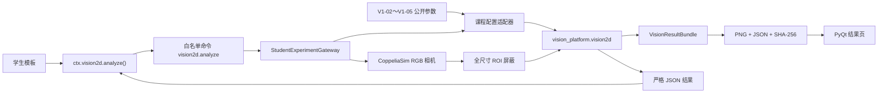

# V2.2-C1 二维视觉课程集成与 V1-02～V1-05 设计

**状态：** 已确认，进入实施

**日期：** 2026-08-02

**目标分支：** `codex/v2-2-vision-curriculum-integration`

**集成基线：** V1-01 `89cc12f`，检出稳定性前置修复 `04c6cf5`

**待集成算法：** `codex/v2-2-vision2d-algorithm-kernel` / `f5bef91`

## 1. 决策摘要

本阶段把已经通过原创合成测试的纯二维算法内核接入已经通过独立验收的
视觉实验公共底座，形成四个可从实验目录运行的正式课程实验：

- `V1-02` 像素尺寸与构件尺寸测量；
- `V1-03` 物体定位与旋转角测量；
- `V1-04` 边缘长度、周长和面积测量；
- `V1-05` 颜色、形状与轮廓识别。

采用“宿主端受控分析”架构。学生程序只能调用新的白名单命令
`vision2d.analyze`。命令不接收学生提供的 ROI、阈值、比例尺、对象路径或
文件路径；宿主端从当前实验的已发布参数构造算法配置，采集 CoppeliaSim
图像，执行 ROI 屏蔽和二维分析，并把原图、中间图、标注图及结构化结果写入
不可变证据包。学生收到经过严格验证的 JSON 原生结果，用它完成观察、判断和
实验报告。

先完成 `V1-02` 的端到端纵向切片，再复用同一命令、适配器、结果包和正式
视觉质检场景接入 `V1-03` 至 `V1-05`。四个实验不修改正式 `.ttt`、URDF、
STL 或机器人资产。

用户已经确认按推荐方案无人值守实施。本文件对非破坏性、在范围内的工程
选择作出最终决策；如果出现需要扩大范围、修改受保护资产或改变课程边界的
阻塞，仍必须停止并报告。

## 2. 已验证前提

### 2.1 V1-01 公共底座

独立验收已经证明：

- 分支 `codex/v2-2-vision-quality-platform` 的远端与本地均为 `89cc12f`；
- 完整静态回归为 `1635 passed, 13 skipped`；
- 显式启用的 CoppeliaSim V1-01 在线验收为 `2 passed`，不是静态 skip；
- V1-01 学生程序按顺序采集 512、256、768 像素三档图像并恢复基线；
- 100% 和 125% PyQt 结果页截图可读；
- 受保护的旧场景、机器人资产、URDF、STL 和 `vision2d` 文件没有被修改。

本集成分支还通过 RED→GREEN 修复了 Windows `core.autocrlf=true` 导致
`profiles.json` 新检出哈希变化的问题。前置提交 `04c6cf5` 后，新的完整静态
基线为 `1636 passed, 13 skipped`。

### 2.2 纯二维算法内核

算法分支 `f5bef91` 已提供：

- `PixelScale`、`Vision2DConfig`、`Vision2DAnalysis` 和结果模型；
- `analyze_image(image_bgr, config)` 内存 BGR 入口；
- 灰度、HSV、前景掩膜、清理后掩膜和标注图；
- 中心、轴对齐框、旋转框、长短边、角度、面积、周长；
- 可选毫米比例尺结果；
- 颜色、形状、顶点数、圆度、长宽比和质量标志；
- `result_to_dict` 严格 JSON 序列化；
- `34 passed` 的算法专项原创合成测试。

这些结果只证明纯算法层；合入后必须在本集成分支重新运行专项、完整静态和
CoppeliaSim 在线验收。

## 3. 范围

### 3.1 本阶段必须完成

1. 以普通 Git 合并提交集成 `f5bef91`，保留算法分支提交历史；
2. 增加实验能力 `vision2d.analysis` 和白名单命令 `vision2d.analyze`；
3. 增加学生 SDK 的只读二维分析入口和严格响应验证；
4. 增加实验参数到算法配置的宿主端适配器；
5. 复用 V1-01 正式视觉质检场景、配置档控制器和结果证据模型；
6. 为 V1-02～V1-05 增加定义、学生模板、教学指南和目录注册；
7. 让 CLI、PowerShell 与 PyQt 通过既有通用入口访问四个实验；
8. 对正式场景执行在线采集、分析、证据复核和 UI 展示验收；
9. 更新发布白名单、合同测试和交付文档；
10. 保持全部真机相关项目为 `PENDING_HARDWARE`，人工教学评价为
    `PENDING_HUMAN_ACCEPTANCE`。

### 3.2 明确不做

- 自动评分、批量成绩、评分规则或教学效果自动结论；
- 学生上传任意算法包、任意 OpenCV 参数或任意 Python 模块；
- V1-06 模板匹配、V1-07 条码、V1-08 OCR、V1-09 缺陷检测；
- 机械臂抓取、分仓、运动规划或真实闭环动作；
- 海康 MVS、真实机械臂、急停、气路和物理抓取；
- 真实相机内参、畸变、照度、测量精度或检测准确率认证；
- 修改 `simulation/vision_quality_lab/BL23_vision_quality_lab.ttt`；
- 修改 `simulation/vision_lab/BL23_vision_lab.ttt`、机器人资产、URDF、STL；
- 修改一期 `vision_platform/recognition/color_shape.py`。

## 4. 方案比较

### 4.1 学生进程直接导入算法内核

优点是实现短，学生可直接处理 `StudentFrame.image_bgr`。缺点是学生可绕过
实验固定配置，算法中间结果和最终结果不一定进入宿主证据，难以证明一次课程
运行究竟使用了哪个 ROI、比例尺和阈值。该方案不用于正式课程入口。

### 4.2 扩展 `camera.capture` 隐式执行分析

优点是命令少。缺点是改变已经发布的采集语义，V1-01 和现有 R1 实验会更难
保持兼容，而且“采集”与“分析”的失败边界不清晰。该方案被否决。

### 4.3 新增无参数白名单分析命令（采用）

`vision2d.analyze` 只表达“按当前实验发布配置完成一次受控分析”。算法配置由
宿主端建立，结果与证据一次提交，学生不能指定路径或任意参数。命令语义明确，
对 `camera.capture` 向后兼容，适合四个实验共享。

## 5. 总体架构



## 6. 实验配置合同

四个定义在 `public_parameters.vision2d` 发布同一精确结构：

```json
{
  "profile_id": "standard",
  "roi_px": [180, 180, 335, 340],
  "min_area_ratio": 0.002,
  "max_area_ratio": 0.05,
  "saturation_min": 60,
  "value_min": 40,
  "pixel_scale_mm": [1.4433756729740643, 1.4433756729740643]
}
```

其中：

- `roi_px` 为 `[x_min, y_min, x_max_exclusive, y_max_exclusive]`；
- ROI 在 512×512 `standard` 配置上覆盖三个彩色标准件并排除右侧机械臂；
- 屏蔽在全尺寸图像上完成，不裁剪坐标系，因此检测中心仍是原图坐标；
- `pixel_scale_mm` 只在 V1-02 与 V1-04 发布；V1-03、V1-05 为 `null`；
- 比例尺来自标准配置、测量平面和虚拟针孔几何的显式计算，只代表该仿真
  平面，不是实物标定结果；
- 适配器只接受精确字段、有限数值、边界内 ROI 和已发布配置档；
- 算法的其余参数使用受测默认值，不从学生命令接收覆盖值。

每个实验还发布：

- `expected_target_count=3`；
- `expected_shapes=["circle", "rectangle", "triangle"]`；
- `analysis_focus`，取 `size`、`pose`、`geometry` 或 `appearance`；
- 针对教学观察的数值容差或允许标签集合。

这些字段用于课程模板和在线验收，不构成自动成绩。

## 7. 命令与 SDK 合同

### 7.1 协议

向 `ALLOWED_COMMANDS` 增加：

```text
vision2d.analyze
```

命令必须是空参数对象。下列请求都必须拒绝：

- 自定义 ROI；
- 自定义阈值或比例尺；
- 文件路径、对象路径、场景脚本或 Remote API 参数；
- 当前实验没有 `vision2d.analysis` 能力；
- 当前相机配置档不是实验发布的 `profile_id`；
- 定义参数无效或相机分辨率与发布配置不一致。

### 7.2 学生 SDK

`StudentContext` 增加 `ctx.vision2d`。公开方法：

```python
analysis = ctx.vision2d.analyze()
```

返回冻结的数据对象，至少包含：

- `snapshot_id`；
- `vision_bundle_path`；
- `profile_id`；
- `status`；
- `image_size`；
- `targets`；
- `rejected_targets`。

SDK 必须严格校验精确顶层字段、ID、状态、尺寸、有限数值、列表/对象类型和
JSON 原生结构。响应缺字段、多字段、非有限数值或异常类型时抛出
`PROTOCOL_RESPONSE_INVALID`。返回对象不暴露可写像素缓冲区，也不接受学生
传入配置。

## 8. 宿主端分析流程

一次 `vision2d.analyze` 按以下顺序执行：

1. 检查实验定义声明 `camera.rgb`、成对的相机/灯光配置能力和
   `vision2d.analysis`；
2. 从绑定后的实验上下文读取并严格验证 `public_parameters.vision2d`；
3. 回读当前配置档，要求等于 `profile_id=standard`；
4. 从 CoppeliaSim 相机读取一帧，并验证 BGR、尺寸、来源、序列和时间戳；
5. 先把原始 PNG 写入运行证据并获得内容哈希；
6. 复制全尺寸图像，把 ROI 外像素置零；
7. 构造 `Vision2DConfig` 和可选 `PixelScale`，调用 `analyze_image`；
8. 把算法结果通过 `result_to_dict` 转成有限 JSON；
9. 生成包含原图、ROI 输入、前景掩膜、清理掩膜和标注图的结果包；
10. 复用已记录的原图记录，原子写入其余 PNG 和结果 JSON；
11. 返回只读结构化结果与证据路径。

如果算法、编码、证据写入或协议响应失败，本次命令失败，不返回部分成功。
已有证据文件不被覆盖；运行最终摘要仍保留错误信息。配置档复位继续沿用现有
运行器清理流程。

## 9. 图层与结果包

每次正式分析结果包按固定顺序包含：

1. `raw`：未修改的 CoppeliaSim 原图；
2. `roi-input`：ROI 外置零后的算法输入；
3. `foreground-mask`：初始二值前景掩膜，转换为三通道 BGR 供统一展示；
4. `cleaned-mask`：形态学清理后的掩膜；
5. `annotated`：轮廓、中心、检测 ID、颜色和形状标注图。

`VisionResultBundle.result` 保存 `result_to_dict` 的完整结果；`profile` 同时保存
相机公开配置与规范化的课程分析配置。包状态直接使用算法状态
`PASS/PARTIAL/NO_TARGETS/REJECTED`。`hardware_status` 固定为
`PENDING_HARDWARE`。

UI 继续使用通用 `vision_result_panel`，不为每个实验复制新页面。在线 UI
验收至少检查原图、掩膜和标注图可以切换，结构化结果可读。

## 10. 四个课程实验

### 10.1 V1-02 像素尺寸与构件尺寸测量

学生读取三个标准件的中心、长边、短边、像素面积以及显式仿真比例尺下的
毫米尺寸。模板记录每个检测 ID 的像素和毫米结果，并检查毫米结果不为 `null`。
自动检查只验证检测数量、字段完整、结果有限、证据齐全和在线重复性；教师
人工检查学生是否能解释像素尺寸、比例尺、测量平面和误差来源。

### 10.2 V1-03 物体定位与旋转角测量

学生读取中心、旋转框和角度。圆形角度必须为 `null` 并带
`ANGLE_UNDEFINED_FOR_CIRCLE`；近方形目标允许带
`ANGLE_AMBIGUOUS_FOR_SQUARE`。实验不发布毫米比例尺，避免把定位观察误写为
真机标定。

### 10.3 V1-04 边缘长度、周长和面积测量

学生比较像素周长、像素面积、圆度和长宽比，并观察显式仿真比例尺产生的
毫米周长和平方毫米面积。教师人工检查学生是否理解离散轮廓、形态学处理和
像素化对周长/面积的影响。

### 10.4 V1-05 颜色、形状与轮廓识别

学生读取颜色、形状、顶点数、轮廓、圆度和质量标志。正式场景期望出现圆、
矩形、三角形三个彩色标准件；模板必须保留 `unknown` 结果，不把未知类别
强行映射为已知类。人工检查学生对 HSV 阈值、轮廓近似和光照边界的解释。

## 11. 场景策略

四个实验复用已经独立生成并验收的：

```text
simulation/vision_quality_lab/BL23_vision_quality_lab.ttt
simulation/vision_quality_lab/scene_manifest.json
simulation/vision_quality_lab/profiles.json
```

这与 R1-01/R1-02、R1-05/R1-07 复用同一能力场景的现有课程组织一致。
正式场景已经包含四个标准件；分析 ROI 只选择三个彩色件，黑色分辨率靶仍供
V1-01 观察，不进入饱和度分割。若在线验收证明固定 ROI 不能稳定排除机械臂或
完整覆盖三个目标，只允许调整实验 JSON 中的发布 ROI 并新增回归测试，禁止
修改 `.ttt` 或放宽算法正确性断言来掩盖问题。

## 12. 课程入口与注册

新增文件：

```text
config/experiments/V1-02.json
config/experiments/V1-03.json
config/experiments/V1-04.json
config/experiments/V1-05.json
student_programs/templates/v1_02_size_measurement.py
student_programs/templates/v1_03_pose_measurement.py
student_programs/templates/v1_04_geometry_measurement.py
student_programs/templates/v1_05_color_shape.py
```

算法分支已有的四份 `docs/experiments/V1-02.md` 至 `V1-05.md` 将扩展为正式
课程指南，补充统一入口、安全边界、学生步骤、预期证据、自动检查、人工检查、
仿真与硬件边界。

目录顺序为 `V1-01`、`V1-02`、`V1-03`、`V1-04`、`V1-05`。既有通用 CLI、
PyQt 实验目录和 `run_experiment.ps1` 继续复用；PowerShell 的枚举白名单增加
四个 ID，不创建四个专用启动器。

## 13. 验收策略

### 13.1 TDD 与提交

每个 Task 必须执行：

```text
RED（新增测试真实失败）
→ GREEN（最小实现）
→ 专项回归
→ 相关完整回归
→ 独立提交
```

不得先实现后补测试。对在线行为，先添加显式开关下会失败的验收测试，再完成
适配；未启用的在线测试显示 `skipped` 时不能写成 PASS。

### 13.2 静态验收

- `tests/test_vision2d` 全部通过；
- 协议、SDK、网关、结果证据、实验目录和模板专项全部通过；
- 完整 `pytest` 回归通过，skip 数量逐项解释；
- `git diff --check` 无错误；
- `RETAINED_FILES.txt` 无重复、无缺失，新正式文件全部登记；
- 发布合同无缺失；
- 受保护 `.ttt`、URDF、STL、机器人资产和一期识别模块哈希不变。

### 13.3 CoppeliaSim 在线验收

显式启动正式视觉质检场景后，对 V1-02～V1-05 分别运行正式学生模板。每个
实验必须证明：

- 初始和最终场景探针通过；
- 当前配置为 `standard`；
- 恰好一次 `vision2d.analyze`；
- 检测到三个目标且状态符合发布合同；
- 结果包包含五个固定图层，所有路径、尺寸和 SHA-256 可复核；
- 结构化字段符合对应课程主题；
- 端口和 CoppeliaSim 进程由包装器正确收尾。

在线验收产物进入新的时间戳目录，不覆盖 V1-01 独立验收证据。

### 13.4 UI 验收

用真实在线结果包运行 PyQt 截图测试，至少验证 100% 和 125% 缩放下：

- 实验 ID、状态和 `PENDING_HARDWARE` 可见；
- 五个图层可切换且标注图可辨识；
- JSON 结果没有截断到不可读；
- 不显示自动评分或真机通过结论。

## 14. 错误边界

使用稳定错误类别：

- `VISION2D_CONTEXT_REQUIRED`：当前实验没有二维分析能力；
- `VISION2D_CONFIG_INVALID`：发布参数不满足精确合同；
- `VISION2D_PROFILE_MISMATCH`：当前配置档或分辨率不匹配；
- `VISION2D_ANALYSIS_FAILED`：算法执行失败；
- 既有 `VISION_RESULT_EVIDENCE_INVALID`：结果包写入或复核失败；
- 既有 `PROTOCOL_RESPONSE_INVALID`：学生 SDK 收到非法响应。

错误消息不泄露任意本机路径或内部对象句柄。学生造成的协议/参数请求错误不应
导致网关接受危险参数；宿主端配置错误必须使实验失败而不是静默回退。

## 15. 文件边界

### 15.1 主要新增或修改

```text
vision_platform/vision2d/**
vision_platform/student/protocol.py
vision_platform/student/sdk.py
vision_platform/student/experiment_gateway.py
vision_platform/student/runner.py
vision_platform/experiments/capabilities.py
config/experiments/**
docs/experiments/V1-02.md ... V1-05.md
student_programs/templates/**
tools/vision_lab/run_experiment.ps1
tests/test_vision2d/**
tests/test_student_programs/**
tests/test_experiments/**
tests/test_vision_quality/**
tests/test_acceptance/**
tests/test_vision_platform/**
RETAINED_FILES.txt
```

### 15.2 禁止修改

```text
simulation/vision_quality_lab/BL23_vision_quality_lab.ttt
simulation/vision_lab/BL23_vision_lab.ttt
simulation/vision_lab/robot_assets/**
vision_platform/recognition/color_shape.py
所有 URDF 和 STL
```

## 16. 完成定义

只有同时满足以下条件，本阶段才可标记完成：

1. 算法分支以可追溯合并提交进入集成分支；
2. V1-02～V1-05 可从实验目录、CLI、PowerShell 和 PyQt 选择；
3. 四个模板只使用公开学生 SDK；
4. 白名单命令不接受学生自定义分析参数；
5. 每次分析生成可复核的五层结果证据；
6. 专项与完整静态回归通过；
7. 四个实验的显式 CoppeliaSim 在线验收通过；
8. 真实在线结果包完成 UI 截图验收；
9. 发布白名单和受保护文件审计通过；
10. 集成分支推送到 GitHub；
11. 报告明确区分算法、静态、在线仿真、人工教学和真机验收层级。

完成时允许声明“V1-02～V1-05 在已执行的 CoppeliaSim 仿真与软件接口范围内
通过”。不得声明真实海康相机、真实机械臂、急停、气路、物理抓取、真实测量
精度或教学效果已经通过；后两类分别保持 `PENDING_HARDWARE` 与
`PENDING_HUMAN_ACCEPTANCE`。
